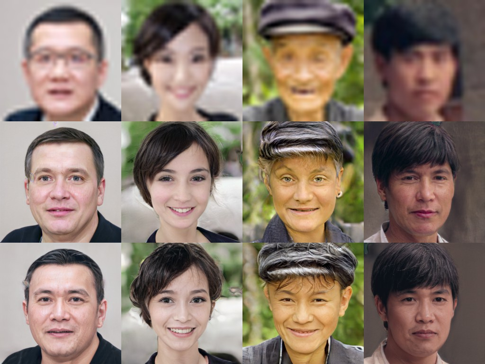
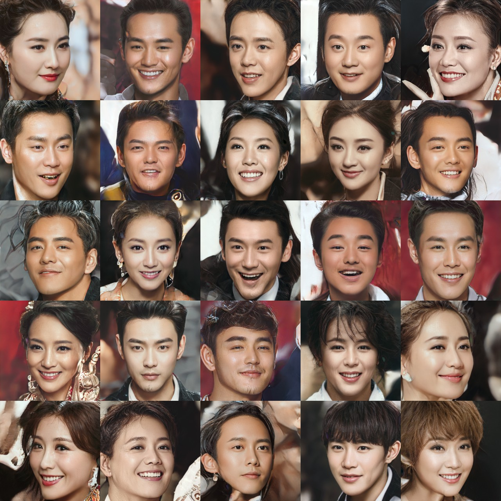

# PULSE-for-chs
<br />

## 项目内容 
&emsp;&emsp;在做人脸超分任务的时候，发现PULSE的结果不是很接地气，超分的结果经常变成欧美人的样貌。这个Github提供的模型对生成脸域做了黄种人限制，使得超分的结果都是黄种人。另外附赠了一个明星脸域的生成器（纯属好玩）。<br />
&emsp;&emsp;Original Github link: https://github.com/adamian98/pulse
<br />

## 效果展示 

### 黄种人脸投射器

---

#### 矫正对比
<br />
第1行：输入；第2行：PULSE输出；第3行：黄种人投射器输出。<br />

---

#### 单幅输出
<br />
输入（32x32）<br />
<br />
输出（1024x1024）<br />

---

### 赠品：明星脸投射器
<p align="center">
	
	<p align="center">
		<em>输入（32x32）<br />⬇</em>
	</p>
</p>

<br />
输出（1024x1024）<br />
似乎和真实明星差别还是挺大的。。。。

===========================================================
## Usage

The main file of interest for applying PULSE is `run.py`. A full list of arguments with descriptions can be found in that file; here we describe those relevant to getting started.

### Prereqs

You will need to install cmake first (required for dlib, which is used for face alignment). Currently the code only works with CUDA installed (and therefore requires an appropriate GPU) and has been tested on Linux and Windows. For the full set of required Python packages, create a Conda environment from the provided YAML, e.g.

```
conda create -f pulse.yml 
```
or (Anaconda on Windows):
```
conda env create -n pulse -f pulse.yml
conda activate pulse
```

In some environments (e.g. on Windows), you may have to edit the pulse.yml to remove the version specific hash on each dependency and remove any dependency that still throws an error after running ```conda env create...``` (such as readline)
```
dependencies
  - blas=1.0=mkl
  ...
```
to
```
dependencies
  - blas=1.0
 ...
```

Finally, you will need an internet connection the first time you run the code as it will automatically download the relevant pretrained model from Google Drive (if it has already been downloaded, it will use the local copy). In the event that the public Google Drive is out of capacity, add the files to your own Google Drive instead; get the share URL and replace the ID in the https://drive.google.com/uc?=ID links in ```align_face.py``` and ```PULSE.py``` with the new file ids from the share URL given by your own Drive file.
 

### Data

By default, input data for `run.py` should be placed in `./input/` (though this can be modified). However, this assumes faces have already been aligned and downscaled. If you have data that is not already in this form, place it in `realpics` and run `align_face.py` which will automatically do this for you. (Again, all directories can be changed by command line arguments if more convenient.) You will at this stage pic a downscaling factor. 

Note that if your data begins at a low resolution already, downscaling it further will retain very little information. In this case, you may wish to bicubically upsample (usually, to 1024x1024) and allow `align_face.py` to downscale for you.  

### Applying PULSE
Once your data is appropriately formatted, all you need to do is
```
python run.py
```
Enjoy!
